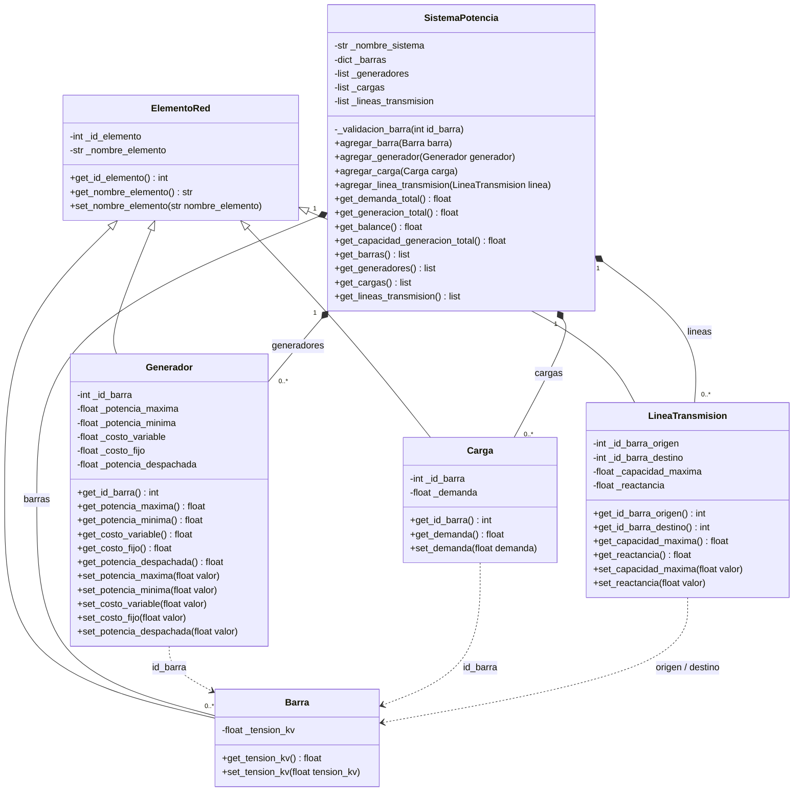

## 1. Diagrama de clases (UML)

```mermaid
classDiagram
    direction TB

    class ElementoRed {
        -int _id_elemento
        -str _nombre_elemento
        +get_id_elemento() int
        +get_nombre_elemento() str
        +set_nombre_elemento(str nombre_elemento)
    }

    class Barra {
        -float _tension_kv
        +get_tension_kv() float
        +set_tension_kv(float tension_kv)
    }

    class Generador {
        -int _id_barra
        -float _potencia_maxima
        -float _potencia_minima
        -float _costo_variable
        -float _costo_fijo
        -float _potencia_despachada
        +get_id_barra() int
        +get_potencia_maxima() float
        +get_potencia_minima() float
        +get_costo_variable() float
        +get_costo_fijo() float
        +get_potencia_despachada() float
        +set_potencia_maxima(float valor)
        +set_potencia_minima(float valor)
        +set_costo_variable(float valor)
        +set_costo_fijo(float valor)
        +set_potencia_despachada(float valor)
    }

    class Carga {
        -int _id_barra
        -float _demanda
        +get_id_barra() int
        +get_demanda() float
        +set_demanda(float demanda)
    }

    class LineaTransmision {
        -int _id_barra_origen
        -int _id_barra_destino
        -float _capacidad_maxima
        -float _reactancia
        +get_id_barra_origen() int
        +get_id_barra_destino() int
        +get_capacidad_maxima() float
        +get_reactancia() float
        +set_capacidad_maxima(float valor)
        +set_reactancia(float valor)
    }

    class SistemaPotencia {
        -str _nombre_sistema
        -dict _barras
        -list _generadores
        -list _cargas
        -list _lineas_transmision
        -_validacion_barra(int id_barra)
        +agregar_barra(Barra barra)
        +agregar_generador(Generador generador)
        +agregar_carga(Carga carga)
        +agregar_linea_transmision(LineaTransmision linea)
        +get_demanda_total() float
        +get_generacion_total() float
        +get_balance() float
        +get_capacidad_generacion_total() float
        +get_barras() list
        +get_generadores() list
        +get_cargas() list
        +get_lineas_transmision() list
    }

    %% Herencia
    ElementoRed <|-- Barra
    ElementoRed <|-- Generador
    ElementoRed <|-- Carga
    ElementoRed <|-- LineaTransmision

    %% Composición: el sistema contiene y gestiona los elementos
    SistemaPotencia "1" *-- "0..*" Barra : barras
    SistemaPotencia "1" *-- "0..*" Generador : generadores
    SistemaPotencia "1" *-- "0..*" Carga : cargas
    SistemaPotencia "1" *-- "0..*" LineaTransmision : lineas

    %% Referencias por ID (no hay objeto Barra dentro de los elementos)
    Generador ..> Barra : id_barra
    Carga ..> Barra : id_barra
    LineaTransmision ..> Barra : origen / destino
```
